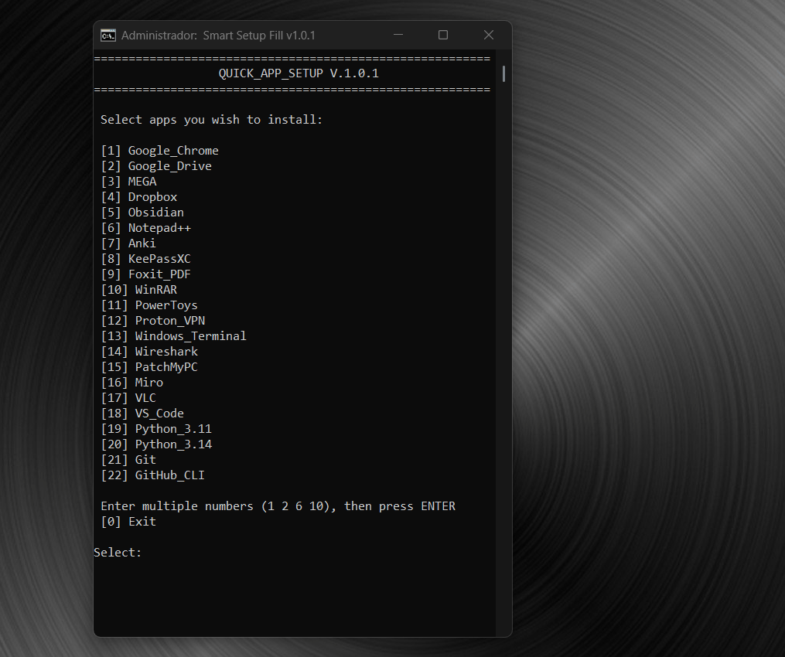

# 🚀 Quick App Setup (Windows)  
  
Automated Windows setup tool using **Batch Script + Winget** to quickly install, verify, and manage essential applications.  

  ---
# 🎬 Demo (what happens in practice)



---  

## 📌 Overview  
  
This project provides a fast and reliable CLI tool to:  
  
- Install multiple applications in one run  
- Automatically skip already installed apps  
- Handle installation failures gracefully  
- Display clean and structured output  
- Generate a final execution summary  
  
---  
  
## 🧠 Key Concepts  
  
This tool is built with a **dynamic app system**:  
  
- Apps are defined using a function (`:add_app`)  
- No manual indexing (`APP_1`, `APP_2`, etc.)  
- The app list is automatically generated  
- Easy to maintain and scale  
  
---  
  
## ⚙️ Built With  
  
- **Windows Batch Script (`.bat`)**  
- **Winget (Windows Package Manager)**  
  
---  
  
## ✨ Features  
  
- Multi-app selection (install multiple at once)  
- Dynamic app list (no manual numbering)  
- Smart detection of installed apps  
- Structured error handling  
- Execution time tracking  
- Optional logging levels  
- Clean CLI output with status indicators:    
  - ✔ Installed  
  - ⚠ Already installed  
  - ✖ Failed

---  
  
## 📦 Supported Applications  
  
> This list is dynamically generated from the script  
  
- Google Chrome  
- Google Drive  
- MEGA  
- Dropbox  
- Obsidian  
- Notepad++  
- Anki  
- KeePassXC  
- Foxit PDF  
- WinRAR  
- 7-Zip  
- PowerToys  
- Proton VPN  
- Windows Terminal  
- Wireshark  
- PatchMyPC  
- Miro  
- VLC  
- VS Code  
- Python 3.11 / 3.14  
- Git  
- GitHub CLI  
  
---  
  
## 🚀 How to Use  
  
### 1. Clone the Repository  
  
```bash  
git clone https://github.com/filipe-maschio/Quick_App_Setup  
cd Quick_App_Setup
```
 
### 2. Run the Script
 
```
Quick_App_Setup.bat
```
 
> ⚠️ Run as **Administrator**
 
### 3. Select Applications

Example:

```
1 2 5 10
```

### 4. Press ENTER

---

## ⚠️ Known Behaviors (Important)

### 🔹 Winget ID Issues

Some packages may fail due to incorrect or outdated IDs.

Example:

- ❌ `Google.Drive` (wrong)
- ✅ `Google.GoogleDrive` (correct)

### 🔹 Hash Mismatch (Winget Limitation)

You may see errors like:

```
Installer hash does not match
```

This is **not a script issue**.

It happens when:

- The installer changes on the vendor side
- The Winget manifest is outdated

Example affected package:

- MEGA (`Mega.MEGASync`)

### 🔹 Already Installed Detection

Apps already installed are automatically skipped:

⚠ Already installed

---

## 🧾 Log Modes

Control installation verbosity:

```
Quick_App_Setup.bat --log "value"
```

|Value|Behavior|
|---|---|
|(empty)|Silent mode|
|1|Partial logs|
|2|Full logs|

Default mode:

```
LOGLEVEL=2
```

---

## 📌 Requirements

- Windows 10 / 11
- Winget installed

Check:

```
winget --version
```

The script automatically validates Winget before execution.

---

## 🧪 Debug Tips

- Use full logs:

```
Quick_App_Setup.bat --log 2
```

- Test individual packages:

```
winget install --id VideoLAN.VLC -e
```

- Update sources:

```
winget source update
```

---

## 🏗️ Project Structure

Quick_App_Setup/  
│  
├── docs  
├── Quick_App_Setup.bat  
└── README.md

---

## 🧠 How Apps Are Defined

Inside the script:

```
call :add_app "VLC" "VideoLAN.VLC"
```

This dynamically builds the menu and installation logic.

---

## 🔧 Customization

### ➕ Adding Apps  
  
Simply add a new line:  

```
call :add_app "Slack" "SlackTechnologies.Slack"
```

### ➖ Removing Apps  
  
Just delete the corresponding line.  

### 🔄 Reordering Apps  
  
Change the order of the lines — the menu will reflect it automatically.

---

## 🤝 Contributing

Feel free to fork, improve, and submit pull requests.

---

## 📌 Status

✅ Stable `v1.0.1`  
🚀 Production-ready for personal automation  

---

## 👨‍💻 Author

Developed by **"Fill" Filipe Maschio**

If this project helped you, consider giving it a star ⭐